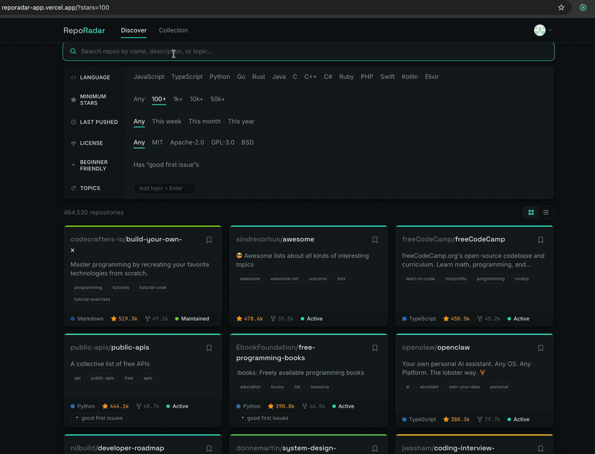

# RepoRadar

[](https://github.com/hai8825/reporadar/actions/workflows/ci.yml)

A smarter alternative to GitHub Trending — search and filter open-source
repositories, read their health at a glance, save the ones you care about, and
compare two side by side.

**[Live demo →](https://reporadar-app.vercel.app)**  ·  sign in with GitHub to try it



## Features

- **Search & filter** — by language, stars, last push, license, topics, and "good first issues"
- **Health at a glance** — a computed activity status (active → inactive) derived from each repo's push history
- **Save & organize** — bookmark repos into folders with tags; your collection persists in Postgres
- **Side-by-side compare** — line up two repos and weigh them against each other
- **Rate-limit aware** — surfaces your remaining GitHub API budget so a search session never dead-ends
- **Rich repo view** — rendered README (relative images/links resolved), languages, and activity
- **Five themes** — light and dark, including a custom Ember dark theme

## Tech stack

Next.js 14 (App Router) · TypeScript (strict) · Apollo Client + GitHub GraphQL
API · GraphQL Code Generator (client preset) · NextAuth (GitHub OAuth, JWT
sessions) · Prisma 7 + Neon Postgres · Tailwind CSS · Vitest · deployed on
Vercel.

## Run locally

1. Create a GitHub OAuth app — callback `http://localhost:3000/api/auth/callback/github`.
2. `cp .env.local.example .env.local`, then fill in `NEXTAUTH_SECRET`
   (`openssl rand -base64 32`), the GitHub client id/secret, and a Neon `DATABASE_URL`.
3. Install and run:
   ```bash
   npm install         # also runs prisma generate
   npm run db:migrate  # apply migrations to your DATABASE_URL branch
   npm run dev
   ```

All routes require a GitHub session. Other scripts: `build`, `verify`
(lint + typecheck + test), `db:status`, `db:studio`.

### Regenerating GraphQL types

Only needed after changing a query or fragment — `gql/` is committed, so a
plain install and build never need a token:

```bash
GITHUB_TOKEN_CODEGEN=$(gh auth token) npm run codegen
```

Any GitHub PAT works; introspection requires no scopes. Add it to `.env.local`
to skip the prefix. `npm run codegen:check` is the CI-side assertion that the
committed output is current.

## Type safety

Not one GraphQL type in this app is hand-written. The chain runs:

**GitHub's introspected schema → generated typed documents → per-fragment
component props → a CI staleness check.**

- **Introspected, not vendored.** `npm run codegen` reads GitHub's live schema,
  so the types cannot drift from the API the way a checked-in SDL would.
  Requires `GITHUB_TOKEN_CODEGEN`; nothing else does.
- **Generated typed documents.** Every operation is a `graphql()` document from
  the codegen [client preset](https://the-guild.dev/graphql/codegen/plugins/presets/preset-client),
  so result and variable types come from the schema. Passing one to `useQuery`
  types the whole response — there is no hand-maintained response type left.
- **Per-fragment props.** A component that renders a repo card takes
  `FragmentType<typeof REPO_CARD_FRAGMENT>` and unmasks it itself, rather than
  a prop type someone kept in sync by hand. Data stays masked from the query
  down to the component that declares the fragment, so a component can only
  read fields its own fragment selected.
- **Committed output + a CI gate.** `gql/` is committed, so builds and Vercel
  never need a token. `npm run codegen:check` regenerates and fails on any
  diff — edit a query without regenerating and CI goes red.

The schema was also more honest than the types it replaced: it flagged four
places where connection nodes are nullable per element that the hand-written
types had declared non-null.

## Architecture highlights

- **Token-passing auth** — the GitHub access token (`read:user public_repo`)
  rides the JWT into the session; an Apollo auth link attaches it to every
  GraphQL request, and `middleware.ts` gates all app routes behind a session.
- **GraphQL discipline** — shared fragments (`RepoCard`, `RepoDetails`); every
  query selects `rateLimit`, surfaced as a nav badge. Cursor pagination via a
  cache type policy keyed by the search string.
- **Optimistic, reconciled saves** — the saved collection persists through
  Server Actions; `SavedReposProvider` applies optimistic updates for instant
  feedback, then reconciles to each action's returned state. `/collection`
  stores only the node id + metadata and batch-fetches live data so
  stars/activity stay fresh.
- **Tested pure logic** — `getActivityLevel` (activity from push history) and
  `buildSearchQuery` (filters → GitHub search string) are unit-tested in isolation.
- **Data model** — NextAuth tables plus `Folder`, `SavedRepo`, `Tag`, and a
  `SavedRepoTag` join; deleting a folder unfiles (never unsaves) a repo, and
  everything cascades from the user.
- **CSS-variable theming** — per-theme `[data-theme]` blocks with a no-flash
  inline script.

## Deployment

Runs on Vercel (Node runtime) over Neon Postgres. The one non-obvious bit: the
app uses Neon's **pooled** endpoint at runtime (serverless → PgBouncer), but
migrations need the **direct** endpoint — `npm run db:deploy:prod` keeps that
split straight.
